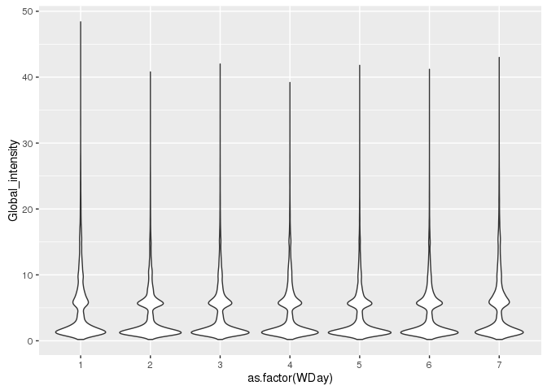
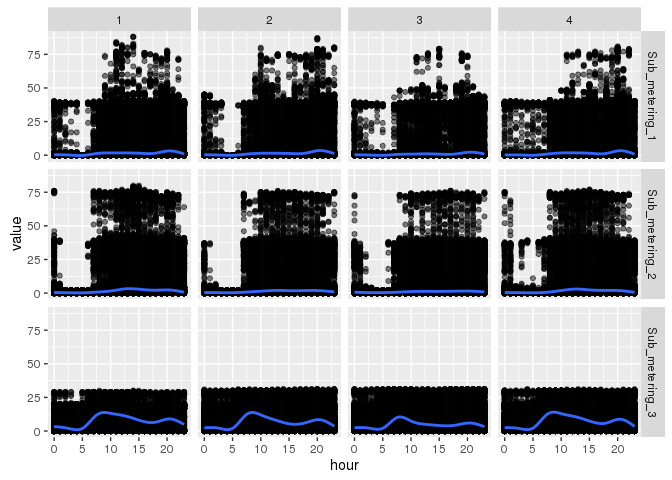
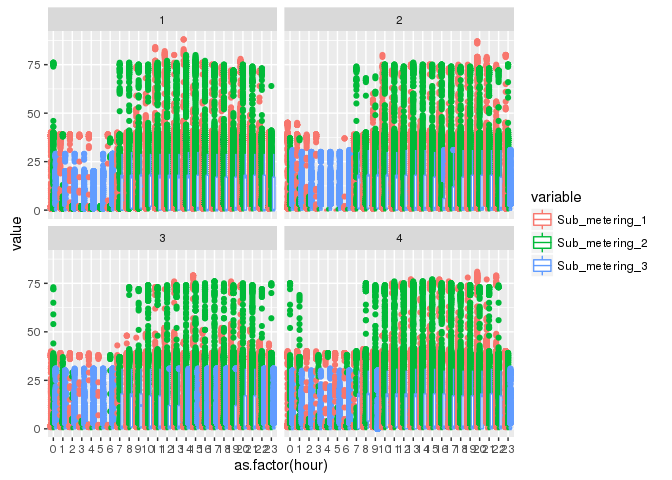

# energy_consumption_analysis
Julia Gustavsen  
July 18, 2016  


This project uses the household power consumption data from an individual household over several years. The idea is that based on the time of year and day of the week we can predict the energy consumption. This will give us better ideas about the times of greatest energy use we can design complementary renewable energy systems that can target times when energy use is highest and energy can be the most expensive. Thus the reduction would help save energy overall and would save money for the consumer/business. 

# Load libraries and read in data


```r
energy_con <- read.csv2("./data/household_power_consumption.txt",
                        na.strings = "?",
                        stringsAsFactors = FALSE)
```

# Understanding the data


## Tidy and format data:


```r
str(energy_con)
```

```
## 'data.frame':	2075259 obs. of  9 variables:
##  $ Date                 : chr  "16/12/2006" "16/12/2006" "16/12/2006" "16/12/2006" ...
##  $ Time                 : chr  "17:24:00" "17:25:00" "17:26:00" "17:27:00" ...
##  $ Global_active_power  : chr  "4.216" "5.360" "5.374" "5.388" ...
##  $ Global_reactive_power: chr  "0.418" "0.436" "0.498" "0.502" ...
##  $ Voltage              : chr  "234.840" "233.630" "233.290" "233.740" ...
##  $ Global_intensity     : chr  "18.400" "23.000" "23.000" "23.000" ...
##  $ Sub_metering_1       : chr  "0.000" "0.000" "0.000" "0.000" ...
##  $ Sub_metering_2       : chr  "1.000" "1.000" "2.000" "1.000" ...
##  $ Sub_metering_3       : chr  "17.000" "16.000" "17.000" "17.000" ...
```

```r
energy_con$Date <- as.Date(energy_con$Date, format = "%d/%m/%Y")

energy_con$Time <- hms(energy_con$Time)
energy_con$Global_active_power <- as.numeric(energy_con$Global_active_power)
energy_con$Global_reactive_power <- as.numeric(energy_con$Global_reactive_power)
energy_con$Voltage <- as.numeric(energy_con$Voltage)
energy_con$Global_intensity <- as.numeric(energy_con$Global_intensity)
energy_con$Sub_metering_1 <- as.numeric(energy_con$Sub_metering_1)
energy_con$Sub_metering_2 <- as.numeric(energy_con$Sub_metering_2)
energy_con$Sub_metering_3 <- as.numeric(energy_con$Sub_metering_3)
```


# Exploratory data analysis

## Examine global active power by day of the year

```r
energy_con$YDay <- yday(energy_con$Date)
ggplot(energy_con,
       aes(x = YDay,
           y = Global_active_power))+
  geom_point(alpha = 0.3)
```

```
## Warning: Removed 25979 rows containing missing values (geom_point).
```

<!-- -->

Could also look at weekday

```r
## Sunday is 1, Saturday is 7
energy_con$WDay <- wday(energy_con$Date)
ggplot(energy_con,
       aes(x = WDay,
           y = Global_active_power))+
  geom_jitter(alpha = 0.3)
```

```
## Warning: Removed 25979 rows containing missing values (geom_point).
```

<!-- -->

Overall global intensity by time of day

```r
ggplot(energy_con,
       aes(x = Time@hour, 
           y = Global_intensity))+
  geom_point(alpha=0.5)
```

```
## Warning: Removed 25979 rows containing missing values (geom_point).
```

<!-- -->

Examine this instead using a violin plot

```r
ggplot(energy_con,
       aes(x = as.factor(Time@hour), 
           y = Global_intensity))+
  geom_violin()
```

```
## Warning: Removed 25979 rows containing non-finite values (stat_ydensity).
```

<!-- -->

Examine the Global intensity by day of the week

```r
ggplot(energy_con,
       aes(x = as.factor(WDay), 
           y = Global_intensity))+
  geom_violin()
```

```
## Warning: Removed 25979 rows containing non-finite values (stat_ydensity).
```

<!-- -->


Look at averages


```r
energy_con$quarter <-quarter(energy_con$Date)
energy_con$hour <- energy_con$Time@hour
grouped_hour_quarter <- group_by(energy_con,
                                quarter,
                                hour)
```


```r
## global intersity
global_intensity_hour_quarter <- dplyr::summarise(grouped_hour_quarter , mean=mean(Global_intensity, na.rm=TRUE), sd=sd(Global_intensity, na.rm=TRUE))
names(global_intensity_hour_quarter) <- c("quarter","hour", "mean", "sd")
```


```r
ggplot(global_intensity_hour_quarter,
       aes(x = hour,
           y = mean))+
  geom_linerange(aes(ymin = mean-sd, ymax = mean+sd))+
  facet_wrap(~quarter)
```

<!-- -->


Examine for patterns by time of year. 


```r
sub_metering_all <- select(energy_con, Date, Time, Sub_metering_1,
                           Sub_metering_2,
                           Sub_metering_3,
                           quarter, hour,WDay)
melt_sub_metering_all <- melt(sub_metering_all, id=c("Date","Time", "quarter", "hour", "WDay"))
head(melt_sub_metering_all)
```

```
##         Date       Time quarter hour WDay       variable value
## 1 2006-12-16 17H 24M 0S       4   17    7 Sub_metering_1     0
## 2 2006-12-16 17H 25M 0S       4   17    7 Sub_metering_1     0
## 3 2006-12-16 17H 26M 0S       4   17    7 Sub_metering_1     0
## 4 2006-12-16 17H 27M 0S       4   17    7 Sub_metering_1     0
## 5 2006-12-16 17H 28M 0S       4   17    7 Sub_metering_1     0
## 6 2006-12-16 17H 29M 0S       4   17    7 Sub_metering_1     0
```


```r
ggplot(melt_sub_metering_all,
       aes(x=hour,
           y=value,
           colour=variable))+
  geom_point(alpha=0.5)+
  geom_smooth()+
  facet_wrap(~quarter)
```

```
## Warning: Removed 77937 rows containing non-finite values (stat_smooth).
```

```
## Warning: Removed 77937 rows containing missing values (geom_point).
```

<!-- -->


```r
ggplot(melt_sub_metering_all,
       aes(x=hour,
           y=value))+
  geom_point(alpha=0.5)+
  geom_smooth()+
  facet_grid(variable~quarter)
```

```
## Warning: Removed 77937 rows containing non-finite values (stat_smooth).
```

```
## Warning: Removed 77937 rows containing missing values (geom_point).
```

<!-- -->


```r
ggplot(melt_sub_metering_all,
       aes(x=WDay,
           y=value))+
  geom_point(alpha=0.2)+
  geom_smooth()+
  facet_grid(variable~quarter)
```

```
## Warning: Removed 77937 rows containing non-finite values (stat_smooth).
```

```
## Warning: Computation failed in `stat_smooth()`:
## x has insufficient unique values to support 10 knots: reduce k.

## Warning: Computation failed in `stat_smooth()`:
## x has insufficient unique values to support 10 knots: reduce k.

## Warning: Computation failed in `stat_smooth()`:
## x has insufficient unique values to support 10 knots: reduce k.

## Warning: Computation failed in `stat_smooth()`:
## x has insufficient unique values to support 10 knots: reduce k.

## Warning: Computation failed in `stat_smooth()`:
## x has insufficient unique values to support 10 knots: reduce k.

## Warning: Computation failed in `stat_smooth()`:
## x has insufficient unique values to support 10 knots: reduce k.

## Warning: Computation failed in `stat_smooth()`:
## x has insufficient unique values to support 10 knots: reduce k.

## Warning: Computation failed in `stat_smooth()`:
## x has insufficient unique values to support 10 knots: reduce k.

## Warning: Computation failed in `stat_smooth()`:
## x has insufficient unique values to support 10 knots: reduce k.

## Warning: Computation failed in `stat_smooth()`:
## x has insufficient unique values to support 10 knots: reduce k.

## Warning: Computation failed in `stat_smooth()`:
## x has insufficient unique values to support 10 knots: reduce k.

## Warning: Computation failed in `stat_smooth()`:
## x has insufficient unique values to support 10 knots: reduce k.
```

```
## Warning: Removed 77937 rows containing missing values (geom_point).
```

<!-- -->


```r
ggplot(melt_sub_metering_all,
       aes(x=as.factor(hour),
           y=value,
           colour=variable))+
  geom_boxplot()+
  facet_wrap(~quarter)
```

```
## Warning: Removed 77937 rows containing non-finite values (stat_boxplot).
```

<!-- -->


```r
ggplot(melt_sub_metering_all,
       aes(x=as.factor(hour),
           y=value,
           colour=variable))+
  geom_violin()+
  facet_wrap(~quarter)
```

```
## Warning: Removed 77937 rows containing non-finite values (stat_ydensity).
```

<!-- -->


```r
yday_vs_globint <- lm(YDay ~ Global_intensity, data = energy_con)
summary(yday_vs_globint)
```

```
## 
## Call:
## lm(formula = YDay ~ Global_intensity, data = energy_con)
## 
## Residuals:
##      Min       1Q   Median       3Q      Max 
## -182.776  -90.040   -1.052   90.511  207.522 
## 
## Coefficients:
##                   Estimate Std. Error t value Pr(>|t|)    
## (Intercept)      184.35056    0.10558 1746.07   <2e-16 ***
## Global_intensity  -0.71836    0.01646  -43.66   <2e-16 ***
## ---
## Signif. codes:  0 '***' 0.001 '**' 0.01 '*' 0.05 '.' 0.1 ' ' 1
## 
## Residual standard error: 104.7 on 2049278 degrees of freedom
##   (25979 observations deleted due to missingness)
## Multiple R-squared:  0.0009291,	Adjusted R-squared:  0.0009286 
## F-statistic:  1906 on 1 and 2049278 DF,  p-value: < 2.2e-16
```


```r
tidy(yday_vs_globint)
```

```
##               term   estimate  std.error  statistic p.value
## 1      (Intercept) 184.350561 0.10558043 1746.06749       0
## 2 Global_intensity  -0.718357 0.01645505  -43.65571       0
```

```r
glance(yday_vs_globint)
```

```
##      r.squared adj.r.squared    sigma statistic p.value df    logLik
## 1 0.0009291322  0.0009286447 104.6918  1905.821       0  2 -12439045
##        AIC      BIC    deviance df.residual
## 1 24878096 24878134 22460847119     2049278
```

```r
obs_stats <- augment(yday_vs_globint)
head(obs_stats)
```

```
##   .rownames YDay Global_intensity  .fitted   .se.fit   .resid         .hat
## 1         1  350             18.4 171.1328 0.2381310 178.8672 5.173764e-06
## 2         2  350             23.0 167.8283 0.3110362 182.1717 8.826662e-06
## 3         3  350             23.0 167.8283 0.3110362 182.1717 8.826662e-06
## 4         4  350             23.0 167.8283 0.3110362 182.1717 8.826662e-06
## 5         5  350             15.8 173.0005 0.1978522 176.9995 3.571547e-06
## 6         6  350             15.0 173.5752 0.1856842 176.4248 3.145753e-06
##     .sigma      .cooksd .std.resid
## 1 104.6917 7.551223e-06   1.708517
## 2 104.6917 1.336320e-05   1.740083
## 3 104.6917 1.336320e-05   1.740083
## 4 104.6917 1.336320e-05   1.740083
## 5 104.6917 5.104441e-06   1.690675
## 6 104.6917 4.466747e-06   1.685185
```

```r
ggplot(obs_stats, aes(.resid)) + geom_density()
```

<!-- -->

```r
ggplot(obs_stats, aes(x = Global_intensity, y = .resid)) + geom_point() + geom_hline(yintercept=0)
```

<!-- -->


```r
yday_vs_globint_glm <- glm(YDay ~ Global_intensity, data = energy_con)
tidy(yday_vs_globint_glm)
```

```
##               term   estimate  std.error  statistic p.value
## 1      (Intercept) 184.350561 0.10558043 1746.06749       0
## 2 Global_intensity  -0.718357 0.01645505  -43.65571       0
```


